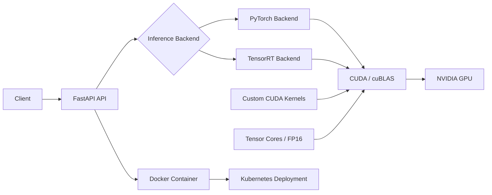

# AccelServe

**CUDA-Accelerated AI Inference & GPU Optimization Platform**

AccelServe is a hands-on GPU systems engineering project that explores the full path from low-level CUDA programming to production-style AI inference serving.

The project was built incrementally to understand how GPU performance changes across custom CUDA kernels, memory movement, shared-memory optimization, cuBLAS, Tensor Cores, PyTorch, TensorRT, FastAPI, Docker, and Kubernetes.

The goal is not only to make inference fast, but to understand **why** it is fast, where bottlenecks appear, and how performance changes when moving from a kernel benchmark to a complete serving system.

---

## Architecture



---

## Project Goals

AccelServe was built to study and demonstrate:

- C++ fundamentals
- CUDA programming
- GPU memory management
- host vs device memory
- CUDA thread, block, and grid execution
- CPU vs GPU benchmarking
- CUDA Events
- GPU data residency
- matrix multiplication
- shared-memory tiling
- synchronization with `__syncthreads()`
- cuBLAS GEMM
- FP16
- Tensor Cores
- mixed-precision inference
- PyTorch CUDA inference
- batch-size scaling
- ONNX export
- NVIDIA ModelOpt
- TensorRT engine generation
- TensorRT inference execution
- CUDA Graph capture and replay
- FastAPI inference serving
- HTTP latency and throughput benchmarking
- Docker containerization
- Docker image optimization
- Kubernetes deployment
- NVIDIA GPU resource scheduling

---

## Repository Structure

```text
accelserve/
├── api/
│   ├── backends.py
│   ├── client.py
│   └── server.py
│
├── benchmarks/
│   ├── inference_benchmark.py
│   ├── results.md
│   └── http_results.md
│
├── cuda/
│   ├── vector_add.cu
│   ├── matrix_mul.cu
│   └── tensor_core_gemm.cu
│
├── docker/
│   ├── Dockerfile
│   └── Dockerfile.gpu
│
├── inference/
│
├── kubernetes/
│   ├── deployment.yaml
│   ├── deployment-cpu.yaml
│   └── service.yaml
│
├── profiling/
│
├── src/
│   └── cpu_vector_add.cpp
│
├── CMakeLists.txt
├── requirements.txt
├── requirements-cpu.txt
├── .dockerignore
├── .gitignore
└── README.md
```

---

# 1. C++ and CPU Baseline

The project started with a CPU vector-addition benchmark written in C++.

This phase established the basic C++ concepts required for later CUDA work:

- functions
- return types
- vectors
- loops
- references
- pointers
- contiguous memory
- `.data()`
- pointer indexing
- memory addresses
- CMake
- Release builds

The first CPU benchmark used one million floating-point values.

After switching to a Release build and adding warmup runs, repeated measurements, and validation, a representative CPU result was:

```text
Minimum: 0.4847 ms
Median:  0.5072 ms
Average: 0.5375 ms
Maximum: 0.7748 ms
```

A pointer-backed version using:

```cpp
const float* ptrA = A.data();
const float* ptrB = B.data();
float* ptrC = C.data();
```

produced approximately:

```text
Minimum: 0.4404 ms
Median:  0.4867 ms
Average: 0.5104 ms
Maximum: 0.7177 ms
```

The small difference was not treated as proof that pointer syntax itself caused the speedup.

The main purpose of this stage was to understand how contiguous memory and raw pointers connect C++ data structures to CUDA device APIs.

---

# 2. First CUDA Kernel

The next step was implementing vector addition on an NVIDIA Tesla T4.

The CUDA kernel used:

```cpp
__global__ void vectorAdd(
    const float* A,
    const float* B,
    float* C,
    int N
) {
    int i =
        blockIdx.x * blockDim.x
        + threadIdx.x;

    if (i < N) {
        C[i] = A[i] + B[i];
    }
}
```

This introduced:

- `__global__`
- GPU kernels
- `cudaMalloc`
- `cudaMemcpy`
- `cudaFree`
- `threadIdx`
- `blockIdx`
- `blockDim`
- grid sizing
- bounds checking
- host memory vs device memory

For one million elements:

```text
Threads per block: 256
Blocks per grid:   3907
Total threads:     1,000,192
```

The extra threads were safely ignored using:

```cpp
if (i < N)
```

The first CUDA result validated successfully.

---

# 3. CUDA Event Benchmarking

CUDA Events were introduced to measure GPU execution accurately.

The benchmark separated:

- host-to-device transfer
- kernel execution
- device-to-host transfer
- total GPU path

Representative result:

```text
Elements: 1,000,000
Runs: 20

Average H2D:      1.7341 ms
Average kernel:   0.0522 ms
Average D2H:      1.0113 ms
Average end-end:  2.8304 ms
```

The kernel itself was much faster than the CPU baseline, but the complete application was slower because transfer overhead dominated.

This demonstrated an important GPU systems principle:

> A fast GPU kernel does not automatically imply a fast application.

---

# 4. Fair CPU vs GPU Benchmark

The CPU and CUDA implementations were then benchmarked on the same Kaggle host.

Representative result:

```text
CPU median:        0.4960 ms
GPU H2D median:    1.7284 ms
GPU kernel median: 0.0518 ms
GPU D2H median:    0.9950 ms
GPU end-end:       2.8109 ms

Kernel speedup:    9.57x
End-end speedup:   0.18x
```

The GPU kernel was approximately 9.6x faster, but the end-to-end GPU path remained slower because vector addition has very low arithmetic intensity.

---

# 5. GPU Data Residency

The benchmark was modified so the input tensors were copied to GPU memory only once and reused across 100 iterations.

The operation was:

```cpp
C[i] += A[i] + B[i];
```

performed 100 times.

Results:

```text
CPU total:       49.17 ms
GPU kernels:      6.43 ms
GPU end-to-end:   9.44 ms

Kernel speedup:   7.64x
End-end speedup:  5.21x
```

This demonstrated another major GPU principle:

> Keeping data resident on the GPU can amortize transfer overhead and transform an otherwise slower GPU application into a faster end-to-end workload.

---

# 6. Matrix Multiplication

The project then moved to matrix multiplication, which is much closer to real AI workloads.

For:

```text
C = A × B
```

each output element is computed as:

```cpp
sum += A[row * N + k] * B[k * N + col];
```

A 512 × 512 matrix multiplication was implemented on both CPU and CUDA.

Representative result:

```text
CPU median:              190.295 ms
Naive CUDA kernel:         1.148 ms
Kernel speedup:          165.7x
```

The large speedup came from the much higher amount of parallel arithmetic compared with vector addition.

---

# 7. Shared-Memory Tiling

The naive CUDA matrix multiplication repeatedly accessed global memory.

The optimized version introduced shared-memory tiles:

```cpp
__shared__ float tileA[16][16];
__shared__ float tileB[16][16];
```

Each 16 × 16 block cooperatively loaded matrix data into shared memory.

Synchronization was performed with:

```cpp
__syncthreads();
```

This ensured:

1. all threads completed loading before computation
2. all threads completed computation before the shared-memory tile was overwritten

Benchmark:

```text
CPU median:        211.51 ms
Naive CUDA:          0.9085 ms
Tiled CUDA:          0.5899 ms

Naive throughput:  295.46 GFLOP/s
Tiled throughput:  455.04 GFLOP/s

Tiling improvement: 1.54x
```

This was the first explicit CUDA memory-hierarchy optimization in the project.

---

# 8. cuBLAS Comparison

The custom CUDA kernels were then compared against NVIDIA cuBLAS SGEMM.

Results:

```text
CPU median:      196.953 ms
Naive CUDA:        1.1507 ms
Tiled CUDA:        0.7472 ms
cuBLAS SGEMM:      0.1392 ms
```

Throughput:

```text
Naive:    233.28 GFLOP/s
Tiled:    359.25 GFLOP/s
cuBLAS: 1,927.97 GFLOP/s
```

cuBLAS was:

```text
8.26x faster than naive CUDA
5.37x faster than tiled CUDA
```

This demonstrated an important production engineering lesson:

> Writing a correct custom CUDA kernel is useful for understanding performance, but production systems should normally use highly optimized NVIDIA libraries when an appropriate primitive already exists.

---

# 9. Tensor Cores and FP16

The project then moved to Tensor Core execution on the Tesla T4.

The comparison used:

```text
FP32 cuBLAS GEMM
vs
FP16 input Tensor Core GEMM with FP32 accumulation
```

Matrix size:

```text
2048 × 2048
```

Results:

```text
FP32 cuBLAS median: 4.0805 ms
FP16 Tensor GEMM:   0.5144 ms
```

Throughput:

```text
FP32:  4.21 TFLOP/s
FP16: 33.40 TFLOP/s
```

Tensor Core speedup:

```text
7.93x
```

This experiment demonstrated why reduced precision is central to modern AI training and inference.

FP16 uses half the storage of FP32 and enables specialized Tensor Core matrix execution.

---

# 10. PyTorch GPU Inference

The project then moved from synthetic CUDA benchmarks to an actual neural network.

The test model was a multilayer perceptron:

```text
Input: 1024
   ↓
Linear 1024 → 4096
   ↓
ReLU
   ↓
Linear 4096 → 4096
   ↓
ReLU
   ↓
Linear 4096 → 1000
```

Batch size:

```text
256
```

The benchmark compared:

- CPU FP32
- GPU FP32
- GPU FP16

Results:

```text
CPU FP32 median: 65.3832 ms
GPU FP32 median:  3.6974 ms
GPU FP16 median:  0.4466 ms
```

Speedups:

```text
GPU FP32 vs CPU:  17.68x
GPU FP16 vs CPU: 146.41x
FP16 vs GPU FP32:  8.28x
```

Numerical difference:

```text
FP32 max absolute error: 0.00000036
FP16 max absolute error: 0.00039878
```

This connected the earlier Tensor Core experiments directly to an AI inference workload.

---

# 11. Batch-Size Scaling

Inference was benchmarked across multiple batch sizes.

FP16 results:

| Batch | Latency | Throughput |
|---:|---:|---:|
| 1 | 0.3032 ms | 3,297.80 samples/s |
| 8 | 0.3462 ms | 23,109.63 samples/s |
| 32 | 0.3609 ms | 88,656.41 samples/s |
| 128 | 0.4959 ms | 258,122.80 samples/s |
| 256 | 0.6558 ms | 390,348.63 samples/s |

The experiment demonstrated the classic inference-serving tradeoff:

```text
small batch
→ lower latency
→ lower throughput

large batch
→ higher latency
→ much higher throughput
```

Tensor Core benefits also became more pronounced as the workload increased.

---

# 12. ONNX Export

The PyTorch model was exported to ONNX using:

```python
torch.onnx.export(...)
```

The generated model was validated with:

```python
onnx.checker.check_model(...)
```

The ONNX model was successfully exported and stored as:

```text
inference/accelserve_mlp_fp32.onnx
```

with external weight data where required.

---

# 13. NVIDIA ModelOpt FP16 Conversion

NVIDIA ModelOpt was installed with ONNX support.

Additional dependencies included:

- ONNX Runtime
- ONNX GraphSurgeon
- Polygraphy
- ONNX Slim

The FP32 ONNX graph was converted to mixed precision.

ModelOpt reported:

```text
Converted 5/5 nodes (100.00%) to fp16
```

The FP16 model was saved as:

```text
inference/accelserve_mlp_fp16.onnx
```

A second model was later generated with native FP16 I/O.

---

# 14. TensorRT Engine Build

TensorRT version:

```text
11.2.1.2
```

The ONNX model was parsed through the TensorRT Python API.

The engine was built using:

```python
builder.build_serialized_network(...)
```

Result:

```text
ONNX parsing: PASSED
TensorRT engine build: PASSED
Engine size: 47.87 MB
```

The FP16 engine used native FP16 input and output tensors:

```text
input  | DataType.HALF | shape: (256, 1024)
output | DataType.HALF | shape: (256, 1000)
```

---

# 15. TensorRT Inference

The first TensorRT benchmark used FP32 I/O while FP16 was used internally.

Result:

```text
TensorRT FP16 median: 0.8212 ms
Throughput:           311,751 samples/s
```

A native FP16 I/O engine was then tested.

Result:

```text
TensorRT native FP16 median: 0.8028 ms
Throughput:                  318,878 samples/s
```

These isolated measurements initially appeared slower than an earlier PyTorch run, which motivated a more rigorous unified benchmark.

---

# 16. CUDA Graphs

TensorRT execution was captured using a CUDA Graph.

Result:

```text
TensorRT CUDA Graph median: 0.7894 ms
Throughput:                 324,287 samples/s
```

CUDA Graphs improved TensorRT slightly in the isolated benchmark, but the difference was small.

This demonstrated that CUDA Graphs are workload-dependent and do not automatically provide large benefits.

---

# 17. Unified Inference Benchmark

A fairer benchmark was created to compare all runtimes in the same session.

The comparison used:

- same GPU
- same session
- same batch size
- same number of runs
- warmup runs
- CUDA Events
- p50
- p95
- p99
- throughput

Environment:

```text
GPU: Tesla T4
Batch size: 256
Runs: 200
```

Results:

| Runtime | p50 | p95 | p99 | Throughput |
|---|---:|---:|---:|---:|
| PyTorch FP16 | 0.8684 ms | 0.8827 ms | 0.8913 ms | 294,805.89 samples/s |
| TensorRT FP16 | 0.5819 ms | 0.5933 ms | 0.5961 ms | 439,935.11 samples/s |
| TensorRT + CUDA Graph | 0.5919 ms | 0.6100 ms | 0.6180 ms | 432,514.27 samples/s |

TensorRT FP16 achieved approximately:

```text
1.49x lower p50 latency than PyTorch FP16
```

and approximately:

```text
49% higher throughput
```

for this workload.

CUDA Graph replay did not improve the TensorRT result in the unified benchmark.

Numerical difference:

```text
Max absolute error:  0.00244141
Mean absolute error: 0.00033709
```

The current benchmark validates that PyTorch and TensorRT use the same model
fingerprint before comparing outputs. This prevents results from being reported
for engines built from different weights.

---

# 18. Nsight Profiling

Nsight Compute was available in the hosted GPU environment:

```text
NVIDIA Nsight Compute
Version 2025.1.1
```

However, hardware performance counters were blocked by the platform.

The profiler returned:

```text
ERR_NVGPUCTRPERM
```

This means the profiling workflow was validated, but detailed GPU hardware-counter analysis could not be completed on the hosted environment.

Nsight Systems was not installed in the Kaggle environment.

Future profiling should be performed on an unrestricted NVIDIA GPU host.

---

# 19. FastAPI Inference Service

AccelServe was then converted into an inference service using FastAPI.

Endpoints:

```text
GET  /health
POST /infer
```

Example health response:

```json
{
  "status": "ok",
  "backend": "pytorch",
  "device": "cpu",
  "cuda_available": false
}
```

The inference endpoint:

1. receives a batch of input vectors
2. validates the input shape
3. converts data into a tensor
4. executes inference
5. measures model latency
6. converts the output back to JSON
7. returns results to the client

---

# 20. Pluggable Inference Backends

The API was refactored into a backend architecture.

Supported backends:

```text
PyTorchBackend
TensorRTBackend
```

Backend selection is controlled with:

```bash
ACCELSERVE_BACKEND=pytorch
```

or:

```bash
ACCELSERVE_BACKEND=tensorrt
```

TensorRT engine location can be configured with:

```bash
ACCELSERVE_ENGINE_PATH=/path/to/model.engine
```

This allows the FastAPI interface to stay constant while the inference implementation changes underneath.

---

# 21. HTTP Serving Benchmark

The local FastAPI service was benchmarked over HTTP.

Initial local CPU results:

| Batch | Model Median | HTTP Median | Serving Overhead | HTTP Throughput |
|---:|---:|---:|---:|---:|
| 1 | 3.44 ms | 11.16 ms | 7.72 ms | 89.60 samples/s |
| 8 | 8.24 ms | 28.39 ms | 20.15 ms | 281.76 samples/s |
| 32 | 13.81 ms | 77.76 ms | 63.95 ms | 411.53 samples/s |

The benchmark showed that model execution was only part of total serving latency.

Additional overhead came from:

- JSON serialization
- JSON parsing
- HTTP handling
- Pydantic validation
- Python list creation
- tensor construction
- output conversion
- networking

This demonstrated an important serving principle:

> Inference performance must be measured end-to-end, not only at the model level.

---

# 22. Docker Containerization

The FastAPI service was containerized with Docker.

The first CPU Docker image used a generic PyTorch installation.

Image size:

```text
Disk usage:   8.03 GB
Content size: 2.86 GB
```

The service ran successfully inside Docker and exposed:

```text
0.0.0.0:8000
```

The `/health` and `/infer` endpoints both returned HTTP 200 responses.

---

# 23. Docker Image Optimization

The CPU container was optimized by using CPU-only PyTorch dependencies.

Optimized image:

```text
accelserve:cpu-slim
```

Image size:

```text
Disk usage:   1.49 GB
Content size: 318 MB
```

Compared with the initial image:

```text
8.03 GB → 1.49 GB
```

This represented approximately:

```text
81% reduction in disk usage
```

and approximately:

```text
89% reduction in content size
```

while preserving functionality.

---

# 24. GPU Docker Image

A separate GPU Dockerfile was added for NVIDIA deployment.

The GPU image is based on NVIDIA TensorRT infrastructure and is intended for:

- CUDA-enabled hosts
- NVIDIA GPUs
- TensorRT inference
- production-style GPU serving

The GPU path cannot be executed on the local Intel Mac and must be tested on an NVIDIA GPU host.

---

# 25. Local Kubernetes Cluster

Docker Desktop Kubernetes was enabled using a kind-based single-node cluster.

Environment:

```text
Context: docker-desktop
Kubernetes: v1.36.1
Nodes: 1
```

Node status:

```text
desktop-control-plane
Ready
control-plane
```

The Kubernetes manifests were first validated as YAML and later deployed against the live cluster.

---

# 26. Kubernetes CPU Deployment

The CPU deployment was created using:

```bash
kubectl apply -f kubernetes/deployment-cpu.yaml
```

The deployment successfully created a pod.

Final pod state:

```text
READY:    1/1
STATUS:   Running
RESTARTS: 0
```

The pod ran the Dockerized FastAPI service with the PyTorch backend.

---

# 27. Kubernetes Port Forwarding

The Kubernetes deployment was exposed locally using:

```bash
kubectl port-forward deployment/accelserve-cpu 8005:8000
```

The current backend-refactored image was verified through:

```text
GET /health
```

Response:

```json
{
  "status": "ok",
  "backend": "pytorch",
  "device": "cpu",
  "cuda_available": false
}
```

This confirmed that Kubernetes was running the latest AccelServe image.

---

# 28. Kubernetes Serving Path

The complete verified local serving path is:

```text
Client
  ↓
kubectl port-forward
  ↓
Kubernetes Deployment
  ↓
Pod
  ↓
Docker Container
  ↓
FastAPI
  ↓
PyTorch Backend
  ↓
CPU
```

The GPU Kubernetes architecture extends the same path with:

```text
TensorRT Backend
  ↓
CUDA
  ↓
NVIDIA GPU
```

---

# 29. Kubernetes GPU Deployment

The GPU deployment manifest requests one NVIDIA GPU using:

```yaml
resources:
  limits:
    nvidia.com/gpu: 1
```

It also selects the TensorRT backend through environment variables.

The target architecture is:

```text
Client
  ↓
Kubernetes Service
  ↓
AccelServe Pod
  ↓
FastAPI
  ↓
TensorRT Backend
  ↓
TensorRT Engine
  ↓
CUDA
  ↓
NVIDIA GPU
```

The GPU Kubernetes deployment has not yet been executed because the local Mac does not contain an NVIDIA GPU.

---

# 30. Current Technology Stack

## GPU and Systems

- C++
- CUDA
- CUDA Runtime API
- CUDA Events
- CUDA Graphs
- shared memory
- GPU data residency
- cuBLAS
- Tensor Cores
- FP16
- mixed precision

## AI and Inference

- PyTorch
- ONNX
- ONNX Runtime
- ONNX GraphSurgeon
- NVIDIA ModelOpt
- TensorRT

## Serving

- FastAPI
- Pydantic
- Uvicorn
- HTTP
- JSON
- configurable inference backends

## Containers and Infrastructure

- Docker
- CPU-only Docker optimization
- NVIDIA GPU Docker architecture
- Kubernetes
- Kubernetes deployments
- Kubernetes services
- readiness probes
- liveness probes
- NVIDIA GPU resource requests
- port forwarding

## Development

- CMake
- Git
- GitHub
- Linux GPU environment
- macOS local development
- Kaggle Tesla T4 environment

---

# 31. Key Engineering Lessons

## Data movement matters

A GPU kernel can be much faster than the CPU while the overall GPU application is slower if transfer overhead dominates.

## Data residency matters

Keeping tensors on the GPU across multiple operations can convert a slower end-to-end workload into a faster one.

## Arithmetic intensity matters

Matrix multiplication benefits GPUs much more than simple vector addition because there is substantially more computation per byte moved.

## Memory hierarchy matters

Shared-memory tiling improved the custom CUDA GEMM by reducing redundant global-memory access.

## Optimized libraries matter

cuBLAS significantly outperformed the hand-written GEMM kernels.

## Precision matters

FP16 Tensor Core execution provided nearly an 8x speedup over FP32 GEMM on the Tesla T4.

## Batch size matters

Larger batches significantly increased GPU throughput.

## Benchmark methodology matters

Single measurements were misleading.

Reliable comparisons required:

- warmup
- repeated runs
- CUDA Events
- medians
- percentiles
- same-session comparisons

## TensorRT performance must be measured

TensorRT did not appear faster in isolated tests, but the unified benchmark showed a clear performance advantage over PyTorch FP16.

## CUDA Graphs are workload-dependent

CUDA Graphs did not improve the final unified TensorRT benchmark.

## Model latency is not serving latency

HTTP, JSON, validation, tensor creation, networking, and output serialization can dominate application-level latency.

## Container size matters

The CPU Docker image was reduced from 8.03 GB to 1.49 GB by installing CPU-only dependencies.

## Deployment layers add overhead

Local Python, Docker, and Kubernetes each introduce additional infrastructure overhead.

Performance should always be evaluated at the level users actually experience.

---

# 32. Limitations

AccelServe is currently an educational and systems-engineering platform rather than a production inference product.

Current limitations include:

- the demonstration neural network is intentionally simple
- the default weights are deterministic demonstration weights, not a trained model
- trained deployments must provide a checkpoint through `ACCELSERVE_CHECKPOINT_PATH`
- TensorRT engine files are hardware-specific
- GPU Docker execution has not yet been validated on an unrestricted NVIDIA Docker host
- GPU Kubernetes deployment has not yet been executed on a GPU-enabled cluster
- Nsight Compute hardware counters were blocked by the hosted environment
- Nsight Systems was unavailable in the hosted environment
- request aggregation across clients is not implemented
- binary tensor transport is not yet implemented
- production authentication is not implemented
- production observability is not implemented
- distributed multi-GPU inference is not implemented
- benchmark results are specific to the tested hardware and workload

---

# 33. Next Steps

Planned extensions include:

- deploy the GPU Docker image on an NVIDIA host
- run TensorRT FastAPI inference inside the GPU container
- validate GPU Kubernetes deployment
- add dynamic request batching
- add asynchronous request handling
- replace large JSON tensor payloads with binary transport
- add request tracing
- add structured logging
- add p50 / p95 / p99 server metrics
- add load testing
- add TensorRT engine caching
- add a trained and versioned checkpoint artifact
- add CUDA kernel fusion experiments
- profile with Nsight Systems
- profile with Nsight Compute on an unrestricted GPU host
- study occupancy and warp stalls
- study memory throughput and cache behavior
- add transformer-based inference workloads
- study quantization
- investigate INT8 and lower-precision inference
- investigate distributed inference
- investigate multi-GPU serving
- publish versioned container images from CI
- add automated benchmark regression tests

---

# Running AccelServe

## Model and engine contract

The PyTorch backend and TensorRT builder load the same model source. By default,
that source is a deterministic demonstration model. To serve trained weights,
set `ACCELSERVE_CHECKPOINT_PATH` to a compatible PyTorch state dictionary when
starting the PyTorch service and when building the TensorRT engine.

Every TensorRT build creates `<engine path>.json`. The manifest records the model
fingerprint, tensor dimensions, precision, and supported batch range. The service
requires both the engine and manifest. TensorRT engines accept batches from 1 to
256, while concurrent calls are serialized around the shared execution context.

The response `model_version` is derived from the model fingerprint, so clients can
identify the weights that produced a result.

## Local PyTorch Service

Start the service:

```bash
ACCELSERVE_BACKEND=pytorch \
python3 -m uvicorn api.server:app --reload
```

Health check:

```bash
curl http://127.0.0.1:8000/health
```

Run the client:

```bash
python3 api/client.py
```

---

## Docker CPU Deployment

Build:

```bash
docker build \
  -f docker/Dockerfile \
  -t accelserve:cpu-slim .
```

Run:

```bash
docker run --rm \
  -p 8000:8000 \
  accelserve:cpu-slim
```

Health check:

```bash
curl http://127.0.0.1:8000/health
```

---

## Configurable Client URL

The inference client can target different deployments using:

```bash
ACCELSERVE_URL=http://127.0.0.1:8000 \
python3 api/client.py
```

For example, a Kubernetes port-forwarded deployment can be tested with:

```bash
ACCELSERVE_URL=http://127.0.0.1:8005 \
python3 api/client.py
```

---

## Kubernetes CPU Deployment

Deploy:

```bash
kubectl apply \
  -f kubernetes/deployment-cpu.yaml
```

Inspect:

```bash
kubectl get deployments
kubectl get pods
```

Port-forward:

```bash
kubectl port-forward \
  deployment/accelserve-cpu \
  8005:8000
```

Health check:

```bash
curl http://127.0.0.1:8005/health
```

---

## Kubernetes GPU Deployment

The GPU manifest is intended for a Kubernetes cluster with:

- NVIDIA GPU nodes
- NVIDIA drivers
- NVIDIA Container Toolkit
- NVIDIA Kubernetes device plugin
- TensorRT-compatible runtime

Deploy with:

```bash
kubectl apply \
  -f kubernetes/deployment.yaml
```

The pod requests:

```yaml
resources:
  limits:
    nvidia.com/gpu: 1
```

and uses:

```text
ACCELSERVE_BACKEND=tensorrt
```

The GPU image builds the engine and its manifest on the target NVIDIA host when
they are not already present. GPU container and Kubernetes execution still need
validation on the target driver, CUDA, and TensorRT combination.

---

# Benchmarking Philosophy

AccelServe treats benchmark numbers as workload-specific evidence, not universal hardware claims.

Benchmark results depend on:

- GPU architecture
- CPU architecture
- batch size
- model dimensions
- precision
- CUDA version
- TensorRT version
- framework version
- kernel implementation
- warmup state
- GPU clocks
- memory hierarchy
- serving transport
- runtime environment

For this reason, AccelServe emphasizes:

```text
measure
→ inspect
→ optimize
→ measure again
```

rather than assuming an optimization will always improve performance.

---

# Project Status

AccelServe currently includes a working end-to-end CPU deployment path and a tested GPU inference optimization path.

Verified locally:

```text
FastAPI
→ Docker
→ Kubernetes
→ PyTorch CPU backend
```

Verified on NVIDIA Tesla T4:

```text
CUDA
→ cuBLAS
→ Tensor Cores
→ PyTorch FP16
→ ONNX
→ ModelOpt
→ TensorRT
→ CUDA Graphs
```

Prepared for future NVIDIA deployment:

```text
FastAPI
→ TensorRT Backend
→ GPU Docker
→ Kubernetes GPU scheduling
```

---

# Author

**Hassan Attout**

Engineering project focused on:

- CUDA programming
- GPU performance engineering
- AI inference optimization
- NVIDIA TensorRT
- production inference serving
- containerization
- Kubernetes
- AI infrastructure

---

# License

No license has been added yet.

If this repository is intended to be open source, an explicit license should be selected and added before external reuse.

---

# Disclaimer

Benchmark results in this repository are specific to the tested hardware, software environment, model architecture, and benchmark methodology.

They should not be interpreted as general performance guarantees across other GPUs, CPUs, models, or production environments.
